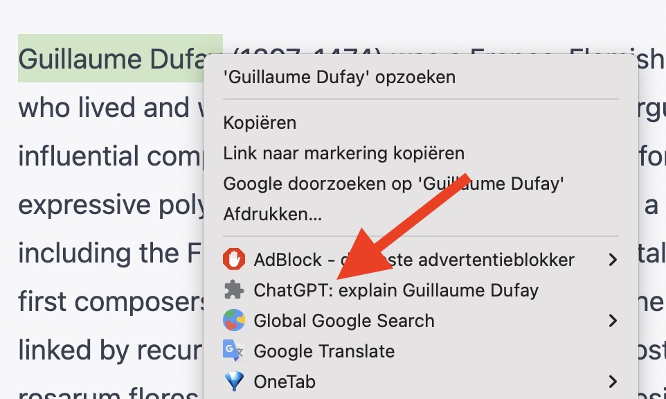
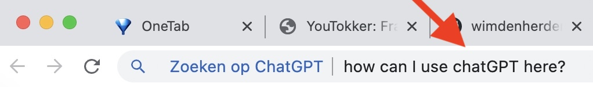
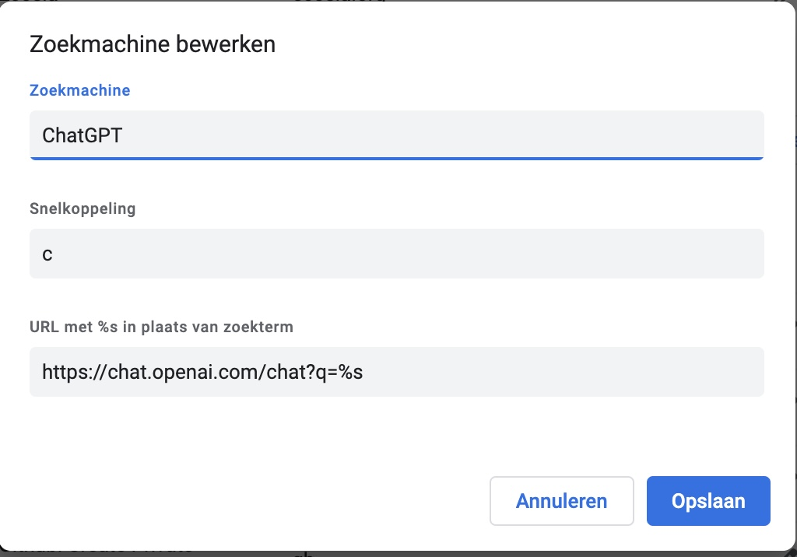

# Query ChatGPT with a menu

The extension will add this to the menu:  

## Installation

- Go to [chrome://extensions/](chrome://extensions/)
- Activate developer modus (right upper corner)
- Load folder
- Refresh the page you want to work on
- Select text, left-click for menu

## Query in the url bar

To be much quicker, you can search chatGPT now like this:  

You have to adjust this in your google chrome browser:  
- Go to [chrome://settings/](chrome://settings/)  
- Click search engines (left menu)  
- Manage search engines  
- Site Search: click Add
- In the field at the bottom fill in: https://chat.openai.com/chat?q=%s

